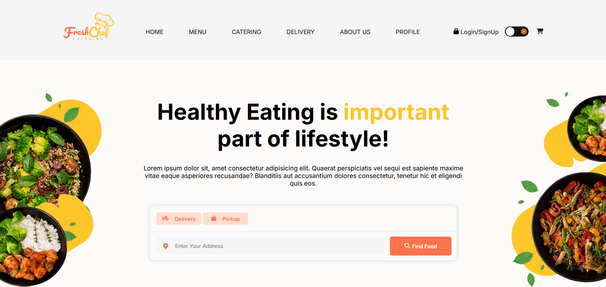

# 🍽️ Fresh Chef – Food & Beverage Delivery and Catering System

### 🏠 Homepage (Customer View)


A full-stack web application developed as a group project for the Bachelor of Information Technology (Hons) program at ESOFT Metro Campus. **Fresh Chef** is designed to streamline online food ordering, delivery, and catering services for local restaurants, providing enhanced customer satisfaction and efficient operations.

---

## 📌 Project Overview

Fresh Chef is a comprehensive solution for managing food orders, deliveries, and catering services in a digital environment. The system includes interfaces for:

- **Customers**: Place and track orders, make payments, leave complaints and feedback.
- **Restaurant Staff**: Manage menus, orders, and catering requests.
- **Delivery Riders**: View and complete assigned deliveries.
- **Admins**: Oversee operations through an analytics and report-driven dashboard.

---

## 🛠️ Technologies Used

### Frontend
- HTML5
- CSS3
- JavaScript
- Bootstrap 5.3

### Backend
- PHP 8.3
- MySQL 5.7 (XAMPP server)

### Tools
- Figma (Wireframing & Prototyping)
- Visual Studio Code
- Git / GitHub
- ClickUp (Project Management)

---

## 🎯 Features

- 🔐 User Authentication (Customer, Staff, Rider, Admin)
- 🛒 Online Food Ordering (Delivery / Pickup)
- 🚚 Real-Time Order Tracking & Status Updates
- 📊 Admin Dashboard with Reports & Analytics
- 💳 Secure Payments (Online / Cash on Delivery)
- 🧾 Complaint Management System
- 📦 Catering Module with Custom Plate Selection
- 🌓 Light/Dark Mode UI
- 📱 Fully Responsive Design

---

## 🧩 System Modules

- Home Page  
- Menu Page  
- Catering Page  
- Delivery Page  
- About Us  
- Customer & Delivery Rider Profiles  
- Admin Dashboard  
- Complaint & Chat System  
- Cart & Checkout

---

## 🚀 Getting Started

1. Clone the repository:
   ```bash
   git clone https://github.com/your-username/fresh-chef.git
